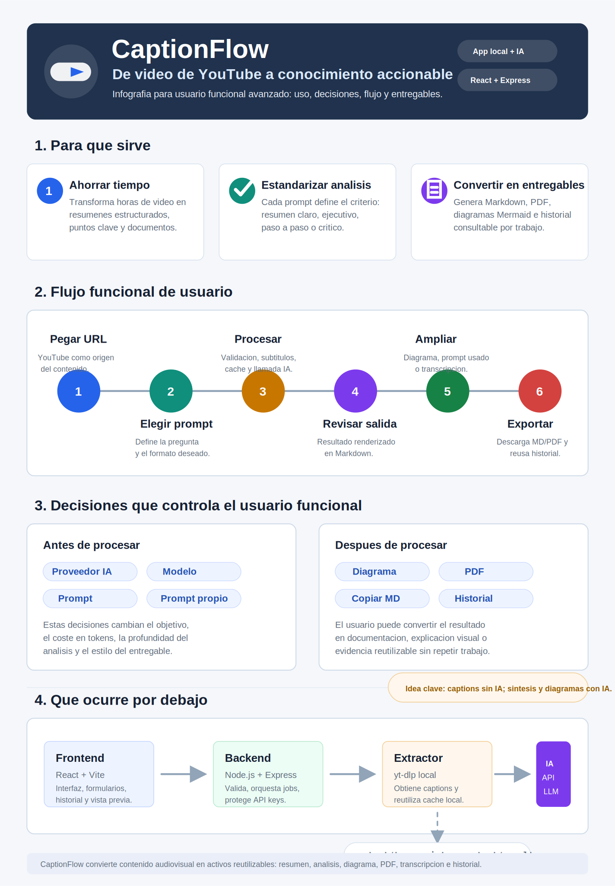

# Infografia funcional avanzada: CaptionFlow

Esta pieza esta pensada para explicar CaptionFlow a un usuario funcional avanzado: que problema resuelve, como se usa, que decisiones toma el usuario, que ocurre por debajo y que entregables obtiene.

## Lectura rapida

- **Entrada:** una URL de YouTube y un objetivo de analisis definido por prompt.
- **Proceso:** CaptionFlow extrae subtitulos, reutiliza cache, combina prompt + transcripcion y llama al proveedor IA activo.
- **Salida:** documento Markdown, historial, PDF, transcripcion consultable y diagramas Mermaid opcionales.
- **Clave funcional:** la extraccion de subtitulos no consume IA; la IA se reserva para interpretar, resumir, estructurar y generar diagramas.

