# Infografía Didáctica: Flujo de Trabajo y Tecnologías (CaptionFlow)

Esta guía visual describe el recorrido de la información desde que el usuario introduce una URL de YouTube hasta que se genera el resumen, el diagrama y se exporta a PDF, detallando qué tecnologías entran en juego en cada fase del proceso.

---

## 1. Mapa de Flujo Operativo y Tecnológico

El siguiente diagrama de flujo (Mermaid) ilustra de forma secuencial y limpia cómo interactúan el usuario, las diferentes capas de tecnología y los servicios externos de Inteligencia Artificial:

```mermaid
flowchart LR
    %% Estilos de Nodos
    classDef frontend fill:#4F46E5,color:#fff,stroke:#3730A3,stroke-width:2px;
    classDef backend fill:#10B981,color:#fff,stroke:#065F46,stroke-width:2px;
    classDef python fill:#F59E0B,color:#fff,stroke:#92400E,stroke-width:2px;
    classDef ai fill:#EC4899,color:#fff,stroke:#9D174D,stroke-width:2px;
    classDef storage fill:#6B7280,color:#fff,stroke:#374151,stroke-width:2px;

    %% Subgrafos (Capas Tecnológicas)
    subgraph UI ["1. Capa Cliente (React + Vite)"]
        direction TB
        A["Entrada URL YouTube y Prompt"]:::frontend
        B["Renderizado Markdown de Resultados"]:::frontend
        C["Acciones: Exportar PDF / Diagrama"]:::frontend
    end

    subgraph Server ["2. Servidor Backend (Node.js + Express)"]
        direction TB
        D["Validar Petición y Enrutar"]:::backend
        G["Orquestar Prompt + Transcripción"]:::backend
        K["Guardar Histórico y Retornar JSON"]:::backend
    end

    subgraph PyExtract ["3. Extractor Local (Python: yt-dlp)"]
        direction TB
        E["Llamada local a yt-dlp"]:::python
        F["Descarga y Limpieza (4-10 segs)"]:::python
    end

    subgraph AICloud ["4. Procesamiento IA (Multi-API)"]
        direction TB
        H["Llamada segura a API"]:::ai
        I{"Proveedor Activo?"}:::ai
        I1["OpenAI"]:::ai
        I2["Google Gemini"]:::ai
        I3["NanoGPT"]:::ai
    end

    subgraph CacheStorage ["5. Persistencia (Ficheros)"]
        direction TB
        S1[("Cache Transcripciones<br>(/output/transcripts)")]:::storage
        S2[("Resultados y PDFs<br>(/output/results)")]:::storage
    end

    %% Conexiones Secuenciales (Flujo de Izquierda a Derecha)
    A -->|POST /api/process| D
    D --> E
    E --> F
    F --> S1
    S1 --> G
    G --> H
    H --> I
    I -->|Key OpenAI| I1
    I -->|Key Gemini| I2
    I -->|Key NanoGPT| I3
    I1 & I2 & I3 --> K
    K --> S2
    K --> B
    B --> C
    C -->|Solicitar Diagrama| D

    %% Leyenda
    subgraph Leyenda ["Leyenda de Componentes"]
        L1["React (Cliente)"]:::frontend
        L2["Express (Servidor)"]:::backend
        L3["Python (Extracción)"]:::python
        L4["LLMs (APIs de IA)"]:::ai
        L5["Almacenamiento"]:::storage
    end
```

---

## 2. Descripción Detallada del Workflow por Etapas

### 🔹 ETAPA 1: Captura de Datos (Usabilidad)
*   **Acción del Usuario:** El usuario introduce un enlace de YouTube en la aplicación y selecciona mediante un menú interactivo (*slicer*) cómo quiere tratar ese vídeo (ej. resumir, extraer puntos clave, etc.).
*   **Tecnología Implicada:** **React + Vite** (interfaz de usuario rápida y dinámica).
*   **Detalle Técnico:** Las API keys se configuran a nivel del servidor; el frontend solo envía la solicitud con el prompt y el vídeo, manteniendo la seguridad.

### 🔹 ETAPA 2: Obtención de la Transcripción (Workflow Técnico Local)
*   **Acción del Sistema:** El servidor recibe la URL y comprueba el caché local. Si no existe, invoca la herramienta de extracción.
*   **Tecnología Implicada:** **Node.js (Express)** orquestando en segundo plano a la librería **Python (`yt-dlp`)**.
*   **Detalle Técnico:** Esta fase es rápida (de **4 a 10 segundos** para vídeos de 10 min) y **no utiliza IA**, lo que optimiza costes y reduce tiempos de espera de la API. La transcripción se guarda de forma estructurada en `output/transcripts/`.

### 🔹 ETAPA 3: Análisis y Consumo IA (Capa de Inferencia)
*   **Acción del Sistema:** El backend une la transcripción obtenida en la Etapa 2 con la plantilla del prompt seleccionado por el usuario y los envía a la API del proveedor de IA activo.
*   **Tecnología Implicada:** Conexión vía API con **OpenAI**, **Google Gemini** o **NanoGPT**.
*   **Detalle Técnico:** La petición consume tokens en función del tamaño del texto. El modelo analiza el contenido y devuelve la respuesta en formato estructurado (Markdown).

### 🔹 ETAPA 4: Presentación, Interactividad e Historial
*   **Acción del Usuario y Sistema:** La respuesta se muestra en la pantalla de forma legible. A partir de ahí:
    *   **Generación de Diagramas (2-3 clics):** Si el usuario solicita un gráfico explicativo, se hace otra llamada rápida a la API y se renderiza un diagrama dinámico y descargable.
    *   **Historial y PDF:** Todo queda archivado en disco local (`output/results/`). El usuario puede consultar, recuperar o imprimir a PDF los resúmenes y diagramas pasados sin volver a consumir tokens.
*   **Tecnología Implicada:** React + librerías de generación y renderizado (Mermaid, PDFKit).
