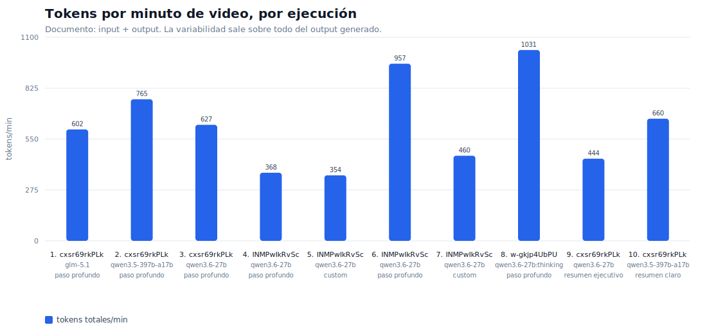
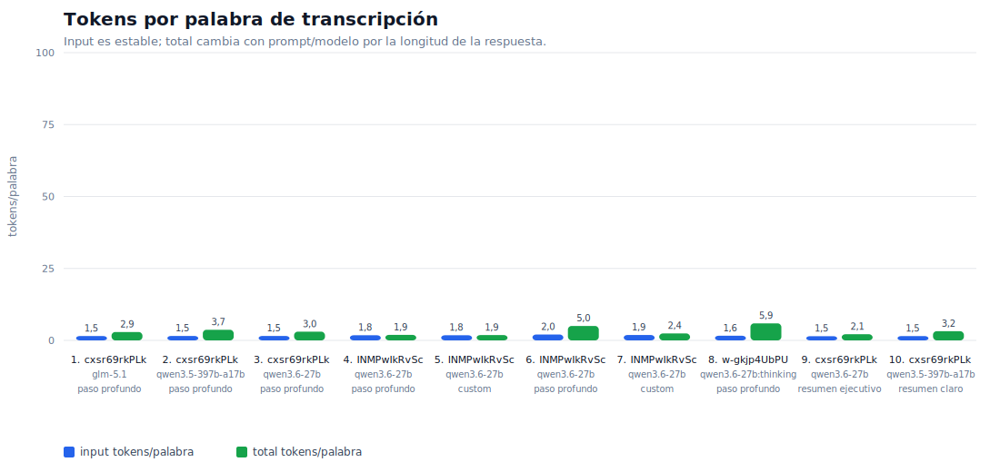

# Comparativa tokens / palabras / minutos

Analisis generado sobre `10` ficheros `.meta.json` en `output/results`. Para no mezclar conceptos, las metricas de tokens usan solo la operacion `document_generation`; las ejecuciones de diagramas y transcripcion quedan fuera del calculo principal.

## Resumen ejecutivo

- Videos analizados: 3. Modelos visibles: 4. Prompts: 4.
- Palabras/minuto del video: media 190,9, rango 174,1-207,3, CV 0,07. Variabilidad baja-moderada.
- Input tokens / palabra: media 1,66, rango 1,46-2,04, CV 0,11. Bastante estable.
- Total tokens / palabra: media 3,21, rango 1,85-5,92, CV 0,40. Alta variabilidad por longitud de respuesta.
- Total tokens / minuto: media 627, rango 354-1031, CV 0,36.

## Grafico 1: tokens por minuto

## Grafico 2: tokens por palabra

## Resumen por video

| video | duración | palabras | pal/min | runs | input tok/pal media | total tok/pal min-max | total tok/min min-max | modelos |
| --- | --- | --- | --- | --- | --- | --- | --- | --- |
| cxsr69rkPLk | 9:59 | 2069 | 207,2 | 5 | 1,51 | 2,14-3,69 | 444-765 | glm-5.1, qwen3.5-397b-a17b, qwen3.6-27b |
| INMPwIkRvSc | 5:41 | 1087 | 191,3 | 4 | 1,87 | 1,85-5,01 | 354-957 | qwen3.6-27b |
| w-gkjp4UbPU | 7:10 | 1248 | 174,1 | 1 | 1,61 | 5,92-5,92 | 1031-1031 | qwen3.6-27b:thinking |

## Resumen por modelo

| modelo | runs | videos | input tok/pal media | total tok/pal media | total tok/min media | seg gen media |
| --- | --- | --- | --- | --- | --- | --- |
| glm-5.1 | 1 | 1 | 1,51 | 2,91 | 602 | 83,1 |
| qwen3.5-397b-a17b | 2 | 1 | 1,52 | 3,44 | 713 | 44,2 |
| qwen3.6-27b | 6 | 2 | 1,75 | 2,73 | 535 | 28,5 |
| qwen3.6-27b:thinking | 1 | 1 | 1,61 | 5,92 | 1031 | 91,4 |

## Tabla por ejecucion

| # | video | prompt | modelo | palabras | min | input tok | output tok | total tok | input/pal | total/min | seg gen |
| --- | --- | --- | --- | --- | --- | --- | --- | --- | --- | --- | --- |
| 1 | cxsr69rkPLk | Paso a paso profundo | glm-5.1 | 2069 | 9,98 | 3126 | 2885 | 6011 | 1,51 | 602 | 83,1 |
| 2 | cxsr69rkPLk | Paso a paso profundo | qwen3.5-397b-a17b | 2069 | 9,98 | 3186 | 4450 | 7636 | 1,54 | 765 | 68,7 |
| 3 | cxsr69rkPLk | Paso a paso profundo | qwen3.6-27b | 2069 | 9,98 | 3188 | 3075 | 6263 | 1,54 | 627 | 60,7 |
| 4 | INMPwIkRvSc | Paso a paso profundo | qwen3.6-27b | 1087 | 5,68 | 1940 | 149 | 2089 | 1,78 | 368 | 5,6 |
| 5 | INMPwIkRvSc | Prompt personalizado | qwen3.6-27b | 1087 | 5,68 | 1939 | 73 | 2012 | 1,78 | 354 | 4,2 |
| 6 | INMPwIkRvSc | Paso a paso profundo | qwen3.6-27b | 1087 | 5,68 | 2217 | 3224 | 5441 | 2,04 | 957 | 56,3 |
| 7 | INMPwIkRvSc | Prompt personalizado | qwen3.6-27b | 1087 | 5,68 | 2028 | 588 | 2616 | 1,87 | 460 | 15,7 |
| 8 | w-gkjp4UbPU | Paso a paso profundo | qwen3.6-27b:thinking | 1248 | 7,17 | 2006 | 5381 | 7387 | 1,61 | 1031 | 91,4 |
| 9 | cxsr69rkPLk | Resumen ejecutivo | qwen3.6-27b | 2069 | 9,98 | 3015 | 1419 | 4434 | 1,46 | 444 | 28,5 |
| 10 | cxsr69rkPLk | Resumen claro | qwen3.5-397b-a17b | 2069 | 9,98 | 3105 | 3488 | 6593 | 1,50 | 660 | 19,7 |

## Lectura operativa

La proxy mas fiable para prever contexto de entrada es `input tokens / palabra`, no `total tokens`. En estos datos, el input se mueve en torno a 1,5-2,0 tokens por palabra de transcripcion. La variacion existe, pero es contenida: cambia por idioma, prompt incluido y metadata.

La metrica `total tokens` no sirve sola para estimar coste/contexto de entrada porque mezcla input y output. Dos ejecuciones sobre el mismo video pueden tener input casi identico y total muy distinto si el prompt pide una respuesta corta o una guia larga. El caso claro es `INMPwIkRvSc`: con el mismo video y modelo, total tokens va de 2012 a 5441.

Para una regla de producto, usaria: `tokens_input_estimados = palabras_transcripcion * 1,9 + tokens_prompt`. Si solo tienes minutos, primero estima palabras con 190 palabras/minuto para tus datos actuales, o 210 si quieres ir conservador.
