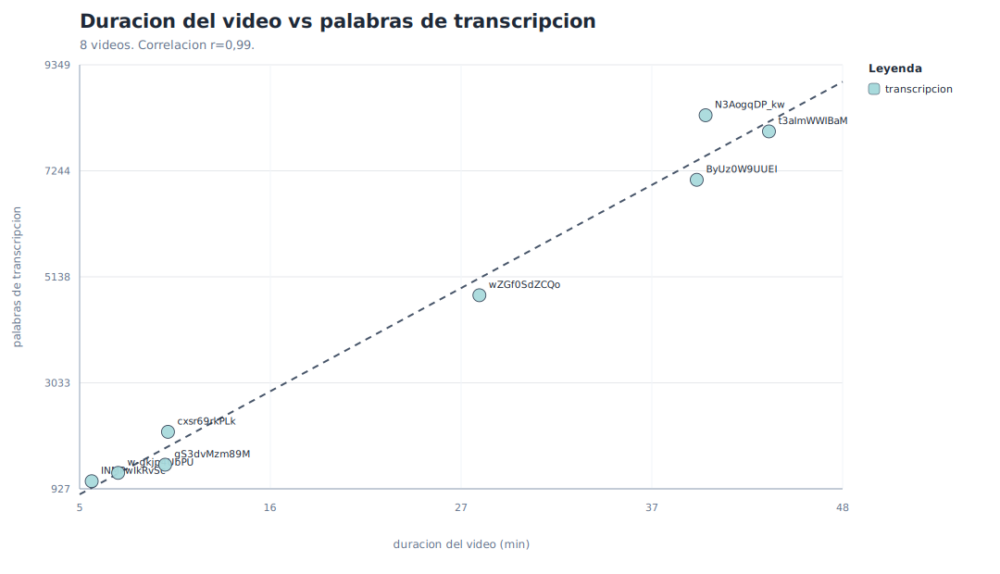
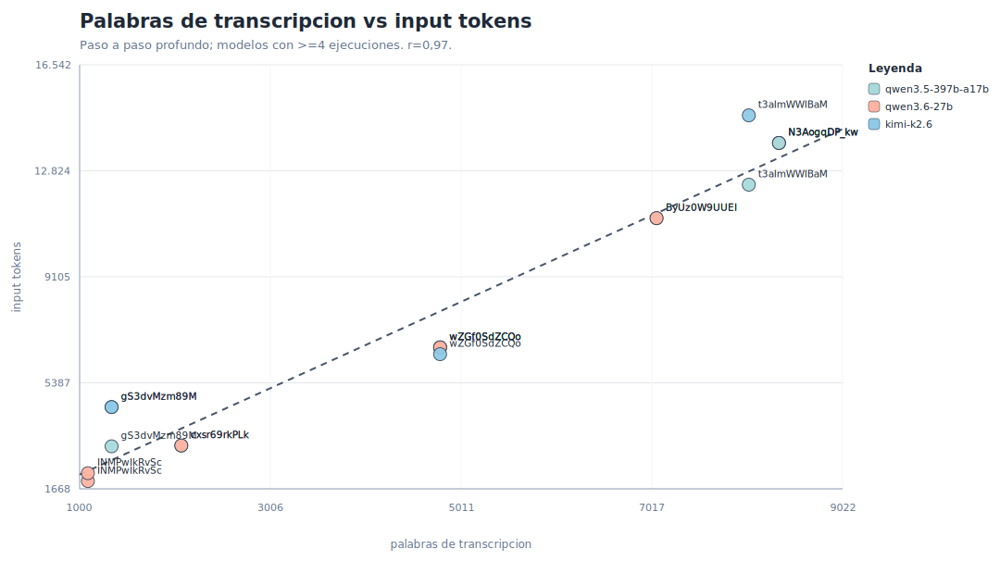
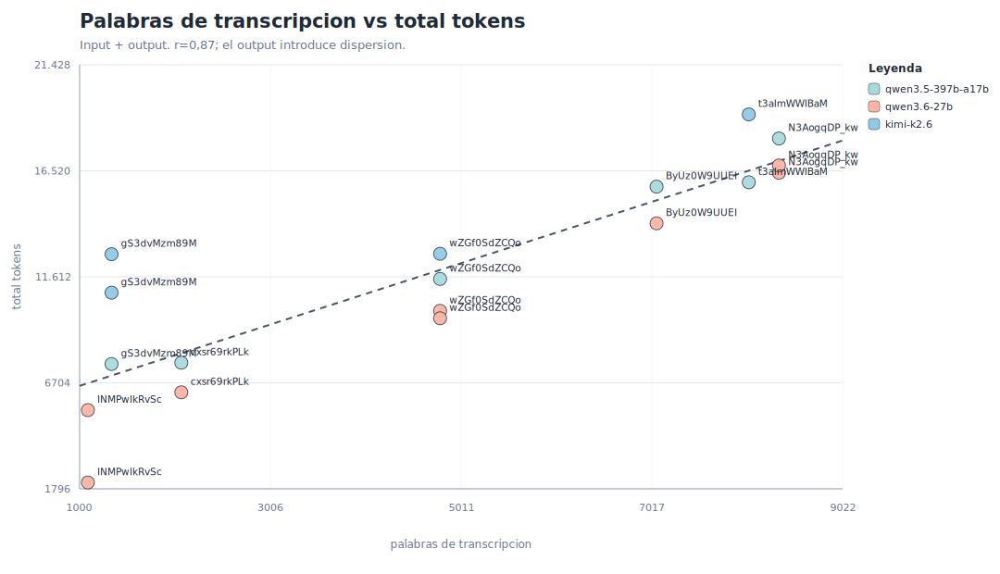
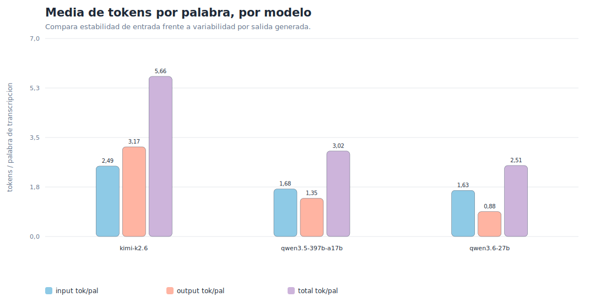
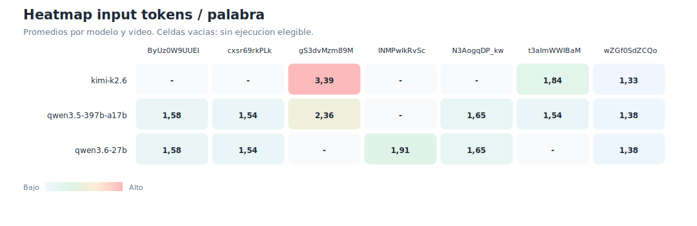
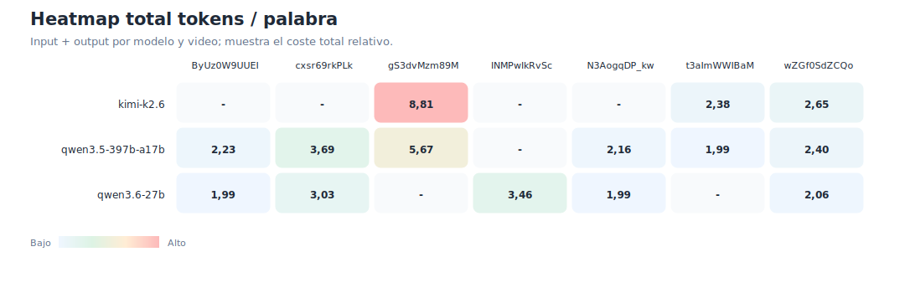

# Relaciones duracion, palabras y tokens

Informe generado desde datos locales. La primera parte usa todas las transcripciones cacheadas y no considera prompts, modelos ni resultados. La segunda parte usa solo metadatos de procesos con prompt `Paso a paso profundo` y conserva modelos con al menos 4 ejecuciones.

## 1. Duracion del video vs palabras de transcripcion

La relacion entre duracion y palabras de transcripcion es muy directa en la muestra actual: la correlacion es `0,99`, lo que indica que, a mas minutos, aparecen mas palabras casi linealmente. Aun asi, la pendiente real depende de la densidad de habla de cada video. La media ponderada es `184,7` palabras/minuto, con videos entre `143,2` y `207,2` palabras/minuto. Para estimaciones iniciales, la duracion es un proxy suficientemente util.

| videoId | duracion min | palabras | pal/min | idioma | fuente | canal |
| --- | --- | --- | --- | --- | --- | --- |
| INMPwIkRvSc | 5,68 | 1078 | 189,7 | es-orig | automatic | LibertadDigital |
| w-gkjp4UbPU | 7,17 | 1244 | 173,6 | en-orig | automatic | Dhruvin Shah |
| gS3dvMzm89M | 9,82 | 1406 | 143,2 | ar | official | Microsoft Mechanics |
| cxsr69rkPLk | 9,98 | 2059 | 206,2 | en-orig | automatic | MoreMozi |
| wZGf0SdZCQo | 27,53 | 4772 | 173,3 | en | official | Alejavi Rivera |
| ByUz0W9UUEI | 39,78 | 7065 | 177,6 | es-orig | automatic | Juan Ramón Rallo |
| N3AogqDP_kw | 40,28 | 8347 | 207,2 | es-orig | automatic | Carlos Rojo Running |
| t3aImWWIBaM | 43,85 | 8026 | 183,0 | es-orig | automatic | iosonomauri |

## 2. Palabras de transcripcion vs input tokens

Al filtrar `Paso a paso profundo`, los input tokens siguen bastante bien el tamano de la transcripcion: la correlacion es `0,97`. Esto es esperable porque el input esta dominado por transcripcion + prompt fijo, y al mantener el prompt constante baja mucho el ruido. Las diferencias entre modelos existen, pero son menores que la diferencia provocada por la longitud del video. Esta grafica es la mas util para estimar contexto necesario antes de llamar al modelo.

## 3. Palabras de transcripcion vs total tokens

Los total tokens tambien crecen con las palabras de transcripcion, pero la relacion es menos limpia que en input tokens: la correlacion es `0,87`. La razon es que aqui se mezcla entrada y salida, y cada modelo puede responder con distinta extension aunque reciba una transcripcion parecida. Por eso esta vista sirve mejor para estimar coste total o tiempo de generacion, no para decidir si cabe en contexto.

## 4. Media de tokens por palabra, por modelo

Esta comparacion normaliza por tamano de transcripcion. Si el input tok/pal se mantiene cerca entre modelos, significa que la tokenizacion y el envoltorio del prompt son relativamente estables. En cambio, output tok/pal y total tok/pal muestran el estilo de respuesta de cada modelo: algunos condensan mas, otros expanden mas. Esta grafica ayuda a separar el coste inevitable de lectura del video del coste variable de generacion.

| modelo | runs | videos | input tok/pal media | output tok/pal media | total tok/pal media | total tok/pal rango |
| --- | --- | --- | --- | --- | --- | --- |
| kimi-k2.6 | 4 | 3 | 2,49 | 3,17 | 5,66 | 2,38-9,48 |
| qwen3.5-397b-a17b | 6 | 6 | 1,68 | 1,35 | 3,02 | 1,99-5,67 |
| qwen3.6-27b | 8 | 5 | 1,63 | 0,88 | 2,51 | 1,92-5,01 |

## 5. Heatmap input tokens / palabra por modelo y video

El heatmap de input tok/pal permite detectar si un video o modelo rompe la proporcionalidad esperada. Los colores mas intensos indican mas tokens de entrada por palabra de transcripcion. Como el prompt es el mismo, las celdas deberian moverse en una banda estrecha; si una celda destaca, suele deberse a idioma, formato de subtitulos, texto tecnico, metadata adicional o diferencias de tokenizacion del proveedor. Es una vista practica para validar la regla de estimacion.

## 6. Heatmap total tokens / palabra por modelo y video

El heatmap de total tok/pal muestra la variabilidad que introduce la respuesta generada. Dos celdas con input parecido pueden diferir mucho si el modelo produce una salida mas larga o con mas razonamiento. Por eso conviene leer este mapa como proxy de coste final y no como proxy puro de contexto. Las zonas mas altas senalan combinaciones modelo-video que tienden a generar documentos mas extensos o mas caros.

## Datos de ejecuciones usadas

| video | modelo | palabras | input tok | output tok | total tok | input/pal | total/pal |
| --- | --- | --- | --- | --- | --- | --- | --- |
| cxsr69rkPLk | qwen3.5-397b-a17b | 2069 | 3186 | 4450 | 7636 | 1,54 | 3,69 |
| cxsr69rkPLk | qwen3.6-27b | 2069 | 3188 | 3075 | 6263 | 1,54 | 3,03 |
| INMPwIkRvSc | qwen3.6-27b | 1087 | 1940 | 149 | 2089 | 1,78 | 1,92 |
| INMPwIkRvSc | qwen3.6-27b | 1087 | 2217 | 3224 | 5441 | 2,04 | 5,01 |
| gS3dvMzm89M | kimi-k2.6 | 1336 | 4536 | 6341 | 10.877 | 3,40 | 8,14 |
| gS3dvMzm89M | kimi-k2.6 | 1336 | 4535 | 8125 | 12.660 | 3,39 | 9,48 |
| gS3dvMzm89M | qwen3.5-397b-a17b | 1336 | 3159 | 4415 | 7574 | 2,36 | 5,67 |
| wZGf0SdZCQo | qwen3.5-397b-a17b | 4790 | 6628 | 4886 | 11.514 | 1,38 | 2,40 |
| ByUz0W9UUEI | qwen3.5-397b-a17b | 7066 | 11.161 | 4626 | 15.787 | 1,58 | 2,23 |
| ByUz0W9UUEI | qwen3.6-27b | 7066 | 11.163 | 2925 | 14.088 | 1,58 | 1,99 |
| wZGf0SdZCQo | qwen3.6-27b | 4790 | 6630 | 3406 | 10.036 | 1,38 | 2,10 |
| wZGf0SdZCQo | qwen3.6-27b | 4790 | 6630 | 3063 | 9693 | 1,38 | 2,02 |
| N3AogqDP_kw | qwen3.6-27b | 8353 | 13.802 | 2627 | 16.429 | 1,65 | 1,97 |
| N3AogqDP_kw | qwen3.6-27b | 8353 | 13.802 | 2965 | 16.767 | 1,65 | 2,01 |
| N3AogqDP_kw | qwen3.5-397b-a17b | 8353 | 13.800 | 4216 | 18.016 | 1,65 | 2,16 |
| t3aImWWIBaM | qwen3.5-397b-a17b | 8036 | 12.337 | 3652 | 15.989 | 1,54 | 1,99 |
| t3aImWWIBaM | kimi-k2.6 | 8036 | 14.769 | 4363 | 19.132 | 1,84 | 2,38 |
| wZGf0SdZCQo | kimi-k2.6 | 4790 | 6392 | 6287 | 12.679 | 1,33 | 2,65 |

## Resumen numerico

- Transcripciones analizadas: 8. Correlacion duracion-palabras: 0,99.
- Procesos `Paso a paso profundo`: 25. Procesos tras filtro de modelos >=4 ejecuciones: 18.
- Modelos elegibles: kimi-k2.6, qwen3.5-397b-a17b, qwen3.6-27b.
- Correlacion palabras-input tokens: 0,97.
- Correlacion palabras-output tokens: -0,16.
- Correlacion palabras-total tokens: 0,87.
