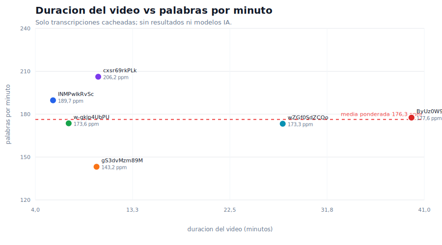

# Analisis duracion vs palabras por minuto

Fuente: `output/transcripts/cache/*.json`. No se han usado resultados de IA, modelos, prompts ni tokens. La cuenta de palabras se calcula sobre el texto de la transcripcion, quitando la cabecera tecnica `Kind: captions / Language` y marcas como `[musica]`.

## Resumen

- Transcripciones actuales: 6.
- Duracion total: 99,96 min.
- Palabras totales: 17.624.
- Palabras/minuto ponderadas por duracion: 176,3.
- Palabras/minuto por video: media simple 177,3, rango 143,2-206,2, desviacion 19,1, CV 0,11.
- Correlacion duracion vs palabras/minuto: -0,07 con solo 6 puntos; no conviene inferir tendencia fuerte.

## Grafico

## Tabla

| videoId | duracion | min | palabras | pal/min | idioma | fuente | canal |
| --- | --- | --- | --- | --- | --- | --- | --- |
| INMPwIkRvSc | 5:41 | 5,68 | 1078 | 189,7 | es-orig | automatic | LibertadDigital |
| w-gkjp4UbPU | 7:10 | 7,17 | 1244 | 173,6 | en-orig | automatic | Dhruvin Shah |
| gS3dvMzm89M | 9:49 | 9,82 | 1406 | 143,2 | ar | official | Microsoft Mechanics |
| cxsr69rkPLk | 9:59 | 9,98 | 2059 | 206,2 | en-orig | automatic | MoreMozi |
| wZGf0SdZCQo | 27:32 | 27,53 | 4772 | 173,3 | en | official | Alejavi Rivera |
| ByUz0W9UUEI | 39:47 | 39,78 | 7065 | 177,6 | es-orig | automatic | Juan Ramón Rallo |

## Lectura

Las transcripciones actuales se mueven entre 143,2 y 206,2 palabras/minuto. La media ponderada es 176,3 ppm. La variabilidad es moderada: el coeficiente de variacion es 0,11.

Para estimar palabras a partir de duracion en esta muestra, una regla razonable seria:

`palabras_estimadas = minutos * 180`

Si quieres ser conservador para videos rapidos o transcripciones densas:

`palabras_estimadas = minutos * 210`
